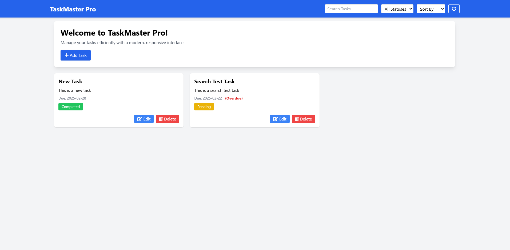

# TaskMaster Pro

TaskMaster Pro is a dynamic and modern task management application built with Django on the backend and Tailwind CSS, jQuery, and Quill on the frontend. This project offers a rich, responsive interface with real-time updates, filtering, sorting, search functionality, and a robust rich text editor for task descriptions. Overdue tasks are clearly flagged to help you stay on top of your schedule.

## Features

- **CRUD Operations:** Create, read, update, and delete tasks seamlessly.
- **Real-Time Updates:** AJAX-powered interactions for a smooth user experience.
- **Filtering & Sorting:** Easily filter tasks by status (pending/completed) and sort by due date or title.
- **Search Functionality:** Quickly search for tasks by title.
- **Rich Text Editor:** Enhance task descriptions using Quill.
- **Overdue Indicator:** Automatically highlights tasks that are past due.
- **Responsive Design:** Fully responsive layout that looks great on mobile, tablet, and desktop.
- **Modern UI:** Clean, utility-first styling with Tailwind CSS and subtle animations.



## Technologies Used

- **Backend:** Django, SQLite (or your preferred database)
- **Frontend:** Tailwind CSS, jQuery, Animate.css, FontAwesome, Quill
- **AJAX:** Real-time client-server communication for dynamic updates

## Getting Started

### Prerequisites

- Python 3.x
- pip
- Git

### Installation

1. **Clone the Repository:**
```bash
   git clone https://github.com/yourusername/taskmaster-pro.git
   cd taskmaster-pro
   ```
   
2. **Create a Virtual Environment:**

```bash
python3 -m venv venv
source venv/bin/activate  # On Windows: venv\Scripts\activate
Install Dependencies:
```
```bash
pip install -r requirements.txt

```
3. **Apply Migrations:**

```bash
python manage.py makemigrations
python manage.py migrate
```

4. **Run the Development Server:**

```bash
python manage.py runserver
```
Visit http://127.0.0.1:8000/ in your browser to see TaskMaster Pro in action.

## Usage
- **Add Task:** Click the "Add Task" button to open the modal and create a new task with a rich text description.
- **Edit/Delete Task:** Use the edit and delete buttons on each task card to modify or remove tasks.
- **Filtering & Sorting:** Utilize the navbar controls to filter tasks by status, sort them by due date or title, and search for specific tasks.
- **Overdue Indicator:** Tasks that are past their due date are automatically marked as "Overdue."

## Contributing
Contributions are welcome! Please open an issue or submit a pull request with your improvements or bug fixes.


## Acknowledgements
Django
Tailwind CSS
Quill
jQuery
Animate.css
FontAwesome